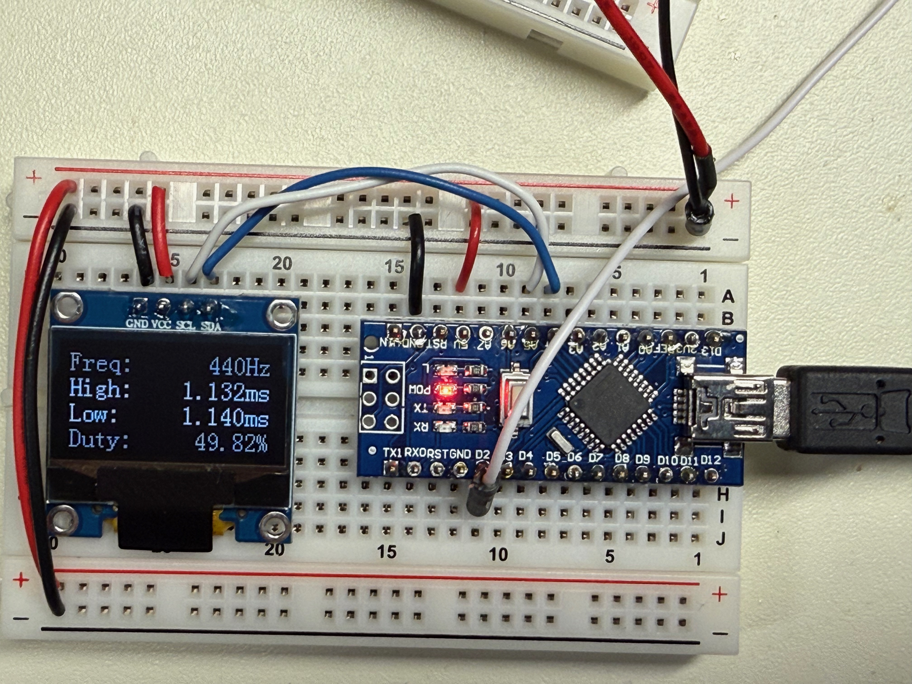

# superfreq

Super-simple frequency counter using an Arduino Nano and SSD1306 I2C 128x64 OLED display

This project uses the [ssd1306lite library](https://github.com/TomNisbet/ssd1306lite) and reference hardware to implement a basic frequency counter.  It is accurate to about 15KHz and can measure below 1Hz.  The signal to be measured is presented on the Arduino's D2 pin and must be 5 volts.

This was created as a quick and convenient way to measure the output of a 555 oscillator clock for the [SAP-Plus TTL Computer](https://github.com/TomNisbet/sap-plus).  Because that clock varied from 1Hz to several KHz, measuring it with an oscilliscope meant that the timing of the scope needed to be adjusted multiple times over the frequency range of the clock.
